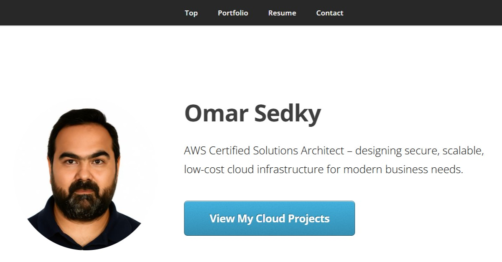
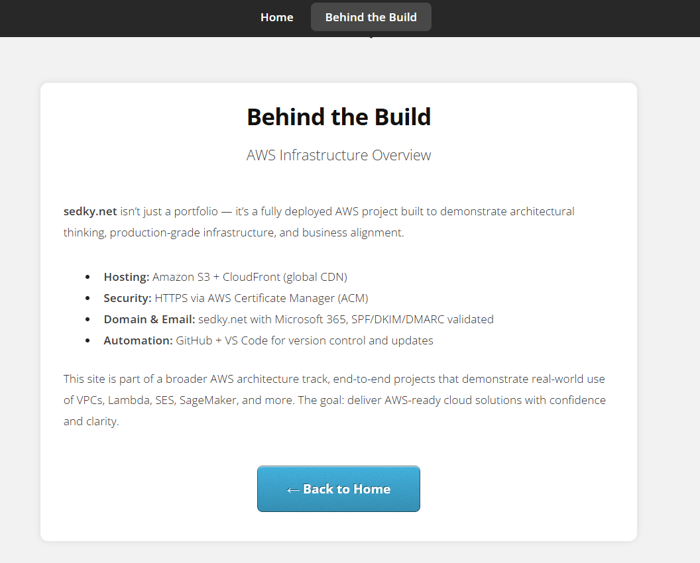
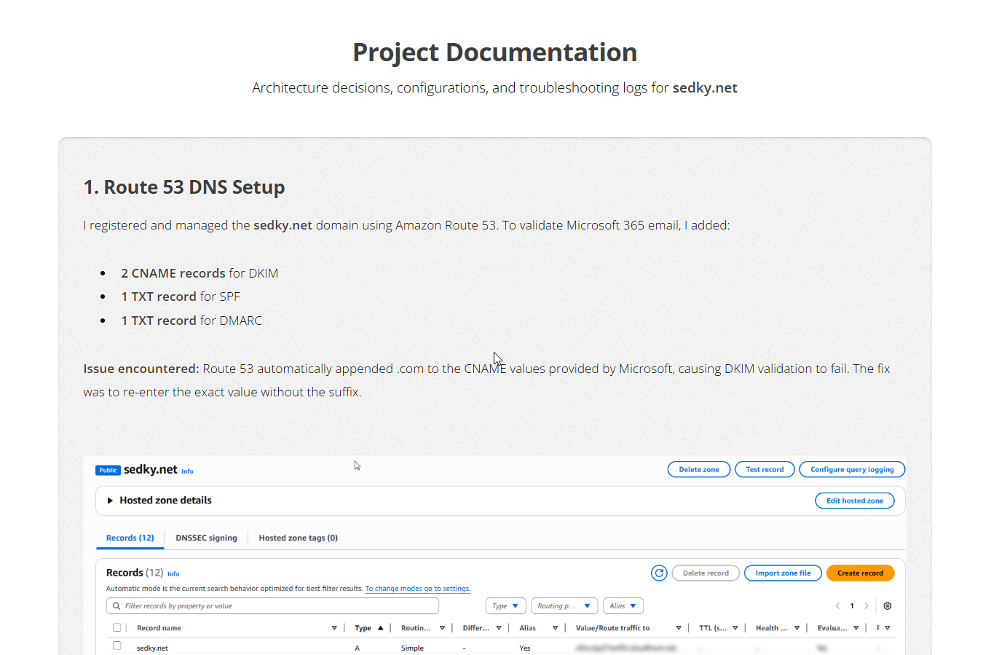

# 🌐 sedky.net — AWS-Driven Portfolio Website

---

## 🔗 Live Site  
🌍 [https://sedky.net](https://sedky.net)

📘 [View Documentation](https://sedky.net/documentation.html)  
🚀 [Behind the Build](https://sedky.net/behind-the-build.html)  
📄 [View My Resume (PDF)](https://sedky.net/assets/resume/Omar_Sedky_Resume.pdf)

---

## 💡 Why This Project Exists

This portfolio isn't just a static site, it's a **fully deployed AWS cloud project** demonstrating real-world infrastructure thinking. Built for **cost-efficiency**, **security**, and **scalability**, it mirrors production-grade decisions used by cloud architects.

Every element — S3, CloudFront, Route 53, ACM, GitHub — was configured with purpose and precision.

---

## 🛠️ Technologies Used

| Service       | Purpose                               |
|---------------|----------------------------------------|
| S3            | Static site hosting                    |
| Route 53      | Domain registration + DNS management   |
| CloudFront    | CDN, HTTPS, global acceleration        |
| ACM           | TLS/SSL certificate (us-east-1)        |
| Microsoft 365 | Custom domain email + SPF/DKIM/DMARC   |
| GitHub        | Version control + documentation        |
| CLI/SDK       | Upload + CloudFront invalidation       |

---

## 🧱 Architecture Steps (Condensed)

### 1. 🔐 IAM & Budgeting
- Created IAM user + enabled billing dashboard
- Set $20/month budget alert

### 2. 🌐 Domain & DNS
- Purchased `sedky.net` via Route 53
- Hosted zone set up for DNS control

### 3. 🪣 S3 Hosting
- Public bucket with static hosting
- Bucket policy configured for public read

### 4. 🚀 CloudFront & ACM
- CloudFront distribution pointing to S3  
- SSL certificate issued via ACM  
- HTTPS enabled with custom error response (404.html)

### 5. 🔒 DNS Integration
- A records pointed to CloudFront
- Verified via dig / nslookup

### 6. 📧 Email Deliverability
- Microsoft 365 MX + TXT + CNAME (SPF/DKIM/DMARC)
- Validated via headers + mail-tester.com (10/10)

---

## 💼 What I Gained

- Route 53 DNS troubleshooting  
- DKIM CNAME validation gotcha (auto-appending `.com`)  
- SSL best practices with ACM  
- Version control and manual deployment with AWS CLI  
- Portfolio clarity for recruiters and cloud teams  

---

## 📌 Next Steps

- More AWS projects (Lambda, SES, SageMaker, CI/CD, Alexa)
- Integrate GitHub Actions for automation
- Publish architecture stories on LinkedIn and GitHub

---

## 🔗 Connect with Me

👤 [LinkedIn – Omar Sedky](https://www.linkedin.com/in/omarsedky)  
📫 Email: omar@sedky.net  
📂 GitHub Repo: [github.com/oSedky/cloud-portfolio](https://github.com/oSedky/cloud-portfolio)

---

## 📸 UI Previews

### 🏠 Homepage

### 🛠 Behind the Build

### 📘 Documentation Page

© 2025 Omar Sedky.